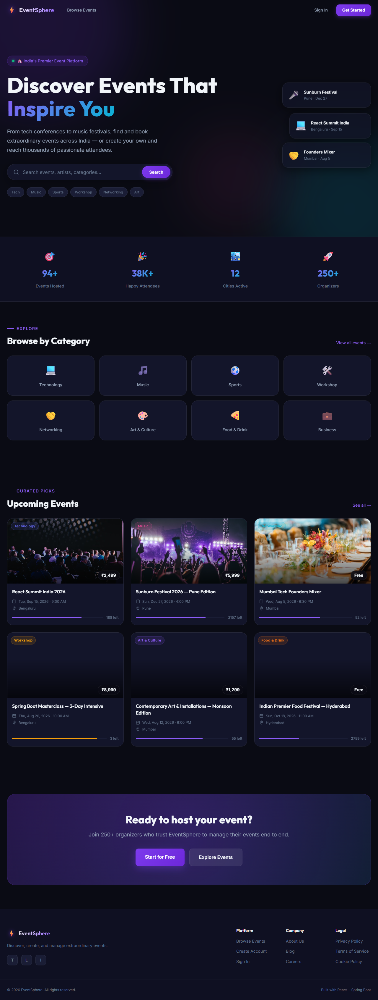
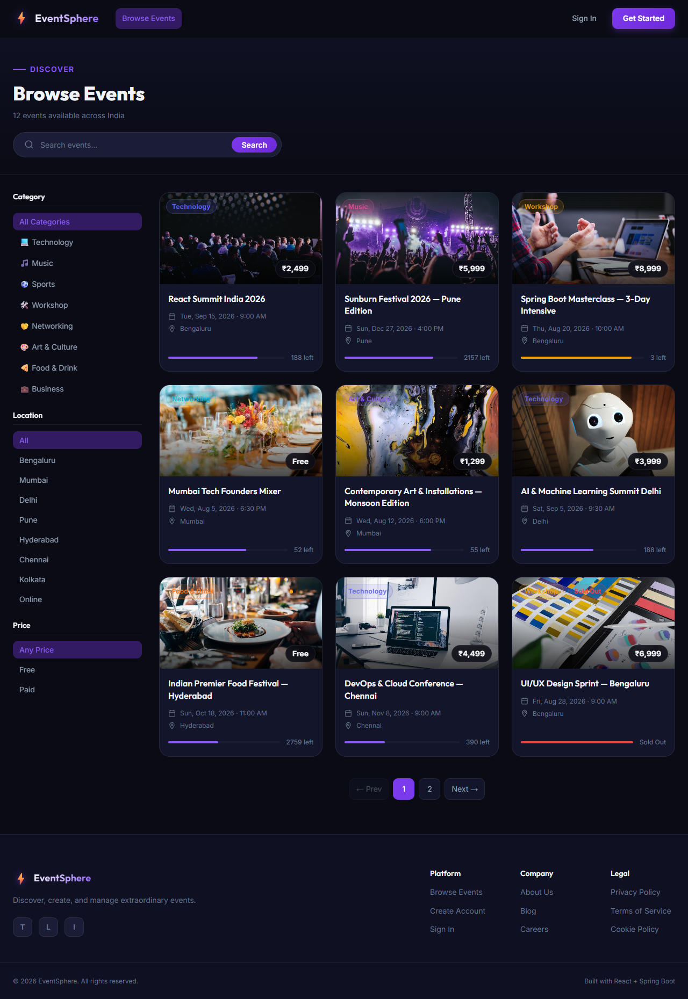
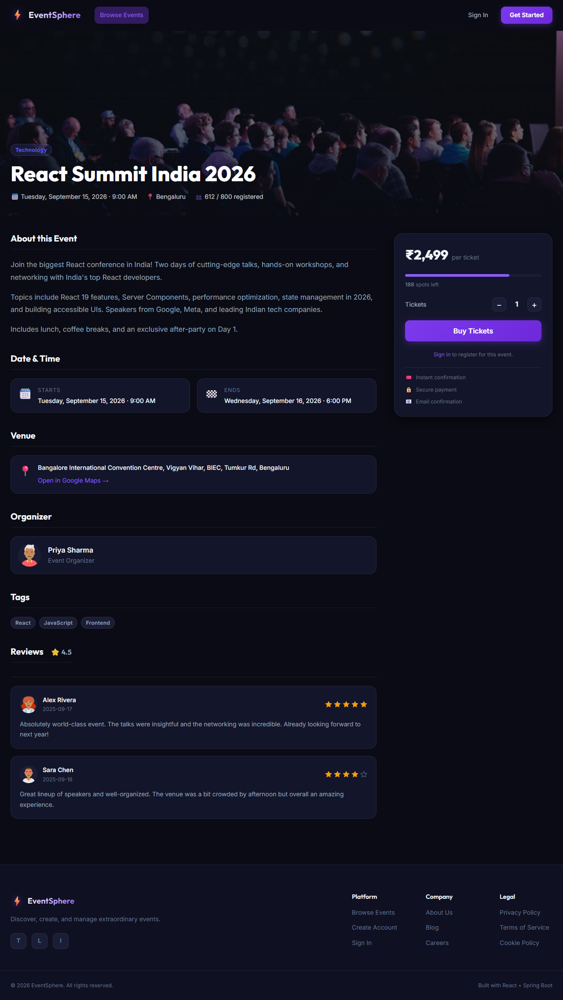

# Event Manager

Event Manager is a modern single-page application for browsing events, viewing event details, and managing registrations. It is built with React and Vite, uses MSW for mock API responses during development, and is packaged for production with Docker.

## Project description

This frontend provides a polished event-management experience with separate pages for the public landing area, event listings, event details, authentication flows, organizer/admin tooling, and user profile areas.

The app is designed to work well in both local development and containerized environments. In development, API requests are mocked with MSW so the UI can be exercised without a live backend. In production, the app is built into static assets and served from a lightweight Node-based static server.

## Features

- Event discovery landing page with featured content
- Event list and event details views
- Registration and checkout flow
- Authentication pages for login and registration
- Organizer and admin dashboards
- Reusable UI primitives such as buttons, badges, modals, cards, and spinners
- Mocked API layer for fast local development
- Responsive UI built with modular CSS
- Dockerized production build

## Tech stack

- React 19
- Vite 8
- React Router DOM 7
- MSW 2 for API mocking
- Axios for API calls
- react-hook-form for form handling
- react-hot-toast for notifications
- Recharts for charts and dashboard visualizations
- date-fns and react-datepicker for date handling and selection
- qrcode.react for QR code generation

## Architecture diagram

The application follows a simple SPA architecture. The UI is composed of route-backed pages, shared components, and context-based state management. API calls flow through the service layer, which can either reach a real backend or be intercepted by MSW in development.

```mermaid
flowchart LR
  Browser[Browser]
  StaticServer[Static server in Docker]
  SPA[React SPA]
  Router[App router]
  Pages[Pages\n(Home, Event List, Details, Auth, Admin)]
  Components[Reusable UI components]
  Contexts[Auth / Cart contexts]
  API[API services]
  MSW[MSW mock handlers]
  Backend[(Real backend API)]

  Browser -->|HTTP| StaticServer
  StaticServer --> SPA
  SPA --> Router
  Router --> Pages
  Pages --> Components
  Pages --> Contexts
  Pages --> API
  API -->|development| MSW
  API -->|production| Backend
```

See `ARCHITECTURE.md` for a deeper breakdown of the runtime flow and module responsibilities.

## Screenshots

The screenshots below are stored in `docs/screenshots/` and were captured from the running app.

### Home page



This view shows the landing experience, headline messaging, and entry points into the rest of the app.

### Event list



This view highlights the browsing experience for discovering multiple events and moving into a specific event’s details.

### Event details / booking



This view shows the event detail layout, where users can review event information and continue into the registration flow.

## Docker instructions

The repository includes a multi-stage `Dockerfile` that builds the Vite app and serves the compiled assets from a small runtime image.

### Build the image

```bash
docker build -t event-manager .
```

### Run the container

```bash
docker run --rm -p 5173:5173 event-manager
```

Then open `http://localhost:5173` in your browser.

### What the container does

- Installs dependencies in a builder stage
- Runs `npm run build` to produce the production bundle in `dist/`
- Copies only the built assets into the runtime image
- Uses `serve` to host the static build on port `5173`

## CI/CD workflow

This repository is ready for a straightforward CI/CD pipeline. A practical workflow would be:

1. **Pull request or push trigger**
	- Run linting with `npm run lint`
	- Run the production build with `npm run build`
	- Optionally verify the Docker image builds successfully

2. **Validation stage**
	- Confirm the app compiles cleanly
	- Check that static assets are generated in `dist/`
	- Fail fast if lint or build steps detect issues

3. **Packaging stage**
	- Build the Docker image from the `Dockerfile`
	- Tag the image with the branch, commit SHA, or release version

4. **Deployment stage**
	- Push the image to a container registry
	- Deploy to the target environment after checks pass

If you add GitHub Actions or another CI provider later, these steps map cleanly to separate jobs and make the release path easy to automate.

## Local development

### Install dependencies

```bash
npm install
```

### Start the dev server

```bash
npm run dev
```

Open `http://localhost:5173`.

During development, API requests are handled by MSW through the mock handlers in `src/mocks/`.

## Repository notes

- `src/routes/AppRouter.jsx` defines the application routes
- `src/api/` contains the service layer for data access
- `src/context/` stores shared state such as authentication and cart/booking data
- `src/components/` contains reusable UI building blocks
- `src/pages/` contains route-level page components

## License

MIT — see `LICENSE`.
